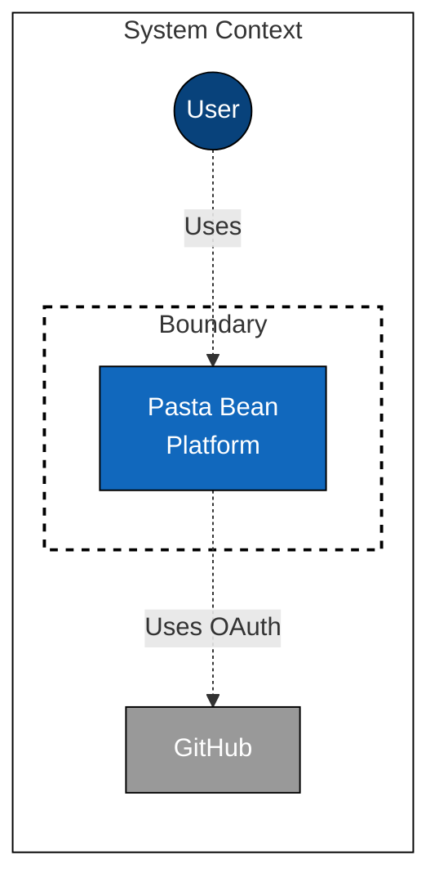
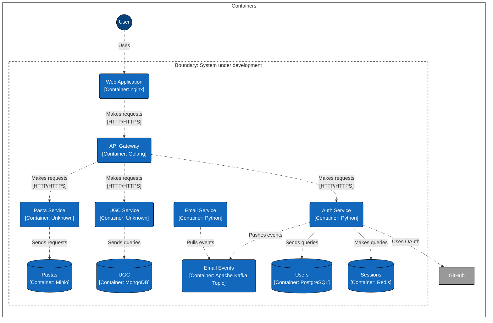

## Pasta Bean Platform

### Архитектура

#### Диаграмма системного контекста

```mermaid
graph LR
    %% C4 style classes c4model.com %%
    classDef person fill:#08427b,stroke:black,color:white;
    classDef mainSystem fill:#1168bd,stroke:black,color:white;
    classDef existingSystem fill:#999999,stroke:black,color:white;
    classDef boundary fill:white,stroke:black,stroke-width:2px,stroke-dasharray: 5 5;
    classDef frame fill:white,stroke:black;

    %% nodes %%
    Person((User)):::person
    MainSystem[Pasta Bean <br>Platform]:::mainSystem
    ExistingSystem["GitHub"]:::existingSystem

    %% connections and boundaries %%
    subgraph Legend [System Context]
        Person-.->|Uses| MainSystem
        subgraph Boundary
            MainSystem
        end
        MainSystem-.->|Uses OAuth| ExistingSystem
        class Boundary boundary
    end
    class Legend frame
```

#### Диаграмма контейнеров

```mermaid
graph LR
    %% C4 style classes c4model.com %%
    classDef person fill:#08427b,stroke:black,color:white;
    classDef container fill:#1168bd,stroke:black,color:white;
    classDef database fill:#1168bd,stroke:black,color:white;
    classDef software fill:#1168bd,stroke:black,color:white;
    classDef existing fill:#999999,stroke:black,color:white;
    classDef boundary fill:white,stroke:black,stroke-width:2px,stroke-dasharray: 5 5;
    classDef frame fill:white,stroke:black;


    %% nodes %%
    ExistingSystem["GitHub"]:::existing
    Person((User)):::person
    WebApp("Web Application<br>[Container: nginx]"):::container
    APIGateway("API Gateway<br>[Container: Golang]"):::container
    AuthService("Auth Service<br>[Container: Python]"):::container
    UsersDB[("Users<br>[Container: PostgreSQL]")]:::database
    SessionCache[("Sessions<br>[Container: Redis]")]:::database
    EmailService("Email Service<br>[Container: Python]"):::container
    EmailEventTopic("Email Events<br>[Container: Apache Kafka Topic]"):::container
    PastaService("Pasta Service<br>[Container: Unknown]"):::container
    PastaStorage[("Pastas<br>[Container: Minio]")]:::database
    UGCService("UGC Service<br>[Container: Unknown]"):::container
    UGCDB[("UGC<br>[Container: MongoDB]")]:::database

    %% connections and boundaries %%
    
    subgraph Legend [Containers]
        Person-.->|Uses| WebApp
        subgraph Boundary["Boundary: System under development"]
            WebApp-.->|"Makes requests <br> [HTTP/HTTPS]"| APIGateway
            APIGateway-.->|"Makes requests <br> [HTTP/HTTPS]"|PastaService
            PastaService-.->|"Sends requests"|PastaStorage
            AuthService-.->|"Pushes events"|EmailEventTopic
            EmailService-.->|"Pulls events"|EmailEventTopic
            APIGateway-.->|"Makes requests <br> [HTTP/HTTPS]"|UGCService
            UGCService-.->|"Sends queries"|UGCDB
            APIGateway-.->|"Makes requests <br> [HTTP/HTTPS]"|AuthService
            AuthService-.->|"Sends queries"|UsersDB
            AuthService-.->|"Makes queries"|SessionCache
        end
        class Boundary boundary
        AuthService-.->|Uses OAuth| ExistingSystem
    end
    class Legend frame
```
