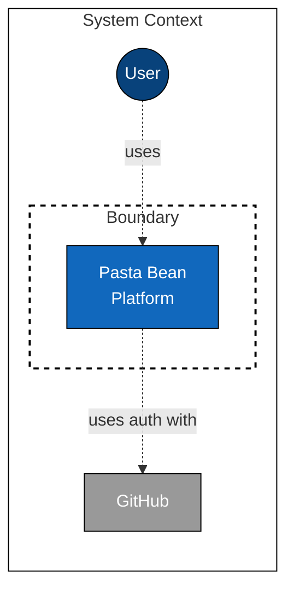

## Pasta Bean Platform

### Архитектура

#### Диаграмма системного контекста

```mermaid
graph LR
    %% C4 style classes c4model.com %%
    classDef person fill:#08427b,stroke:black,color:white;
    classDef mainSystem fill:#1168bd,stroke:black,color:white;
    classDef existingSystem fill:#999999,stroke:black,color:white;
    classDef boundary fill:white,stroke:black,stroke-width:2px,stroke-dasharray: 5 5;
    classDef frame fill:white,stroke:black;

    %% nodes %%
    Person((User)):::person
    MainSystem[Pasta Bean <br>Platform]:::mainSystem
    ExistingSystem["GitHub"]:::existingSystem

    %% connections and boundaries %%
    subgraph Legend [System Context]
        Person-.->|uses| MainSystem
        subgraph Boundary
            MainSystem
        end
        MainSystem-.->|uses auth with| ExistingSystem
        class Boundary boundary
    end
    class Legend frame
```
